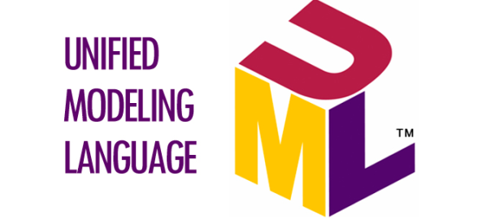

PlantUML
========

The docker image contains the sphinxcontrib.plantuml extension for Sphinx which allows
you to embed UML diagrams using PlantUML.

PlantUML_ is a Java component that allows to write UML diagrams:

* `Sequence diagram <http://plantuml.com/sequence-diagram>`_
* `Usecase diagram <http://plantuml.com/use-case-diagram>`_
* `Class diagram <http://plantuml.com/class-diagram>`_
* `Activity diagram <http://plantuml.com/activity-diagram-beta>`_
* `Component diagram <http://plantuml.com/component-diagram>`_
* `State diagram <http://plantuml.com/state-diagram>`_
* `Object diagram <http://plantuml.com/object-diagram>`_
* `Deployment diagram <http://plantuml.com/deployment-diagram>`_
* `Timing diagram <http://plantuml.com/timing-diagram>`_

And some non-UML diagrams:

* `Wireframe graphical interface <http://plantuml.com/salt>`_
* `Archimate diagram <http://plantuml.com/archimate-diagram>`_
* `Specification and Description Language (SDL) <http://plantuml.com/activity-diagram-beta#sdl>`_
* `Ditaa diagram <http://plantuml.com/ditaa>`_
* `Gantt diagram <http://plantuml.com/gantt-diagram>`_
* `Mathematic with AsciiMath or JLaTeXMath notation <http://plantuml.com/ascii-math>`_
  
Diagrams are defined using a simple and intuitive language.
This can be used within many other tools.
Images can be generated in PNG or SVG format.

Examples
--------

In the Sphinx reST documents,
simply begin the PlantUML code with the ``uml`` directive.

.. begin-basic-example

.. uml::
  
   @startuml
   user -> (use PlantUML)
   note left of user
      Hello!   
   end note
   @enduml

.. end-basic-example

Which is generated by the following code:

.. literalinclude:: 10_plantuml.rst
   :language: rst
   :start-after: begin-basic-example
   :end-before: end-basic-example

Class diagram
=============

Diagram
-------

.. begin-class-diagram-example

.. uml::

      @startuml
      
      'style options 
      skinparam monochrome true
      skinparam circledCharacterRadius 0
      skinparam circledCharacterFontSize 0
      skinparam classAttributeIconSize 0
      hide empty members
      
      Class01 <|-- Class02
      Class03 *-- Class04
      Class05 o-- Class06
      Class07 .. Class08
      Class09 -- Class10
      
      @enduml

.. end-class-diagram-example

Code
----

This is the code for example above.

.. literalinclude:: 10_plantuml.rst
   :language: rst
   :start-after: begin-class-diagram-example
   :end-before: end-class-diagram-example

Note that in docutils / Sphinx, ``@startuml`` and ``@enduml`` could be omitted.
However, it is useful to keep these lines: is necessary, PlantUML can be used
(outside Sphinx) to generate the PNG image files with the diagrams directly
from the text file; also, if editing the code in Eclipse, the PlantUML diagrams
can be previewed without the necessity of building the documentation.

Use case diagram
================

Diagram
-------

.. begin-use-case-diagram-example

.. uml::

   @startuml
   actor "Main Database" as DB << Application >>
   
   note left of DB
      This actor 
      has a "name with spaces",
      an alias
      and a stereotype 
   end note
   
   actor User << Human >>
   actor SpecialisedUser
   actor Administrator
   
   User <|--- SpecialisedUser
   User <|--- Administrator
   
   usecase (Use the application) as (Use) << Main >>
   usecase (Configure the application) as (Config)
   Use ..> Config : <<includes>>
   
   User --> Use
   DB --> Use
   
   Administrator --> Config 
   
   note "This note applies to\nboth actors." as MyNote
   MyNote .. Administrator
   MyNote .. SpecialisedUser
   
   '  this is a text comment and won't be displayed
   AnotherActor ---> (AnotherUseCase)
   
   '  to increase the length of the edges, just add extras dashes, like this:
   ThirdActor ----> (LowerCase)
   
   '  The direction of the edge can also be reversed, like this:
   (UpperCase) <---- FourthActor
   
   @enduml

.. end-use-case-diagram-example

Code
----

.. literalinclude:: 10_plantuml.rst
   :language: rst
   :start-after: begin-use-case-diagram-example
   :end-before: end-use-case-diagram-example

Activity diagram (new syntax)
=============================

Diagram
-------

.. begin-activity-diagram-example

.. uml::

   @startuml
   
   start
   
   :first activity;
   
   :second activity
    with a multiline 
    and rather long description;
   
   :another activity;
   
   note right
     After this activity,
     are two 'if-then-else' examples. 
   end note
   
   if (do optional activity?) then (yes)
      :optional activity;
   else (no)
   
      if (want to exit?) then (right now!)
         stop
      else (not really)
      
      endif
   
   endif   
      
   :third activity;
   
   note left
     After this activity,
     parallel activities will occur. 
   end note
   
   fork
      :Concurrent activity A;
   fork again
      :Concurrent activity B1;
      :Concurrent activity B2;
   fork again
      :Concurrent activity C;
      fork
      :Nested C1;
      fork again
      :Nested C2;
      end fork
   end fork
   
   repeat 
      :repetitive activity;
   repeat while (again?)
   
   while (continue?) is (yes, of course)
     :first activity inside the while loop;
     :second activity inside the while loop;
   endwhile (no)
   
   stop
   
   @enduml

.. end-activity-diagram-example

Code
----

There are two syntaxes to create activity diagrams.
The example utilises the new syntax (which is still incomplete).

.. literalinclude:: 10_plantuml.rst
   :language: rst
   :start-after: begin-activity-diagram-example
   :end-before: end-activity-diagram-example

State diagram
=============

Diagram
-------

.. begin-state-diagram-example

.. uml::

   @startuml
   
   [*] --> MyState
   MyState --> CompositeState
   MyState --> AnotherCompositeState
   MyState --> WrongState
   
   CompositeState --> CompositeState : \ this is a loop   
   AnotherCompositeState --> [*]
   CompositeState --> [*]
   
   MyState : this is a string
   MyState : this is another string
   
   state CompositeState {
   
   [*] --> StateA : begin something
   StateA --> StateB : from A to B
   StateB --> StateA : from B back to A
   StateB --> [*] : end it

   CompositeState : yet another string
   }

   state AnotherCompositeState {
   
   [*] --> ConcurrentStateA    
   ConcurrentStateA --> ConcurrentStateA 
   
   --
   
   [*] --> ConcurrentStateB
   ConcurrentStateB --> ConcurrentStateC
   ConcurrentStateC --> ConcurrentStateB
   }
      
   note left of WrongState
      This state 
      is a dead-end
      and shouldn't
      exist.
   end note
   
   @enduml

.. end-state-diagram-example

Code
----

.. literalinclude:: 10_plantuml.rst
   :language: rst
   :start-after: begin-state-diagram-example
   :end-before: end-state-diagram-example

GUI mockups
===========

PlantUML can also be used for GUI mockups (see http://plantuml.sourceforge.net/salt.html).

.. begin-mockup-example1

.. uml::

   @startuml
   salt
   {
     Just plain text
     [This is my button]
     ()  Unchecked radio
     (X) Checked radio
     []  Unchecked box
     [X] Checked box
     "Enter text here   "
     ^This is a droplist^
   }
   @enduml
      
.. end-mockup-example1

Code
----

.. literalinclude:: 10_plantuml.rst
   :language: rst
   :start-after: begin-mockup-example1
   :end-before: end-mockup-example1
